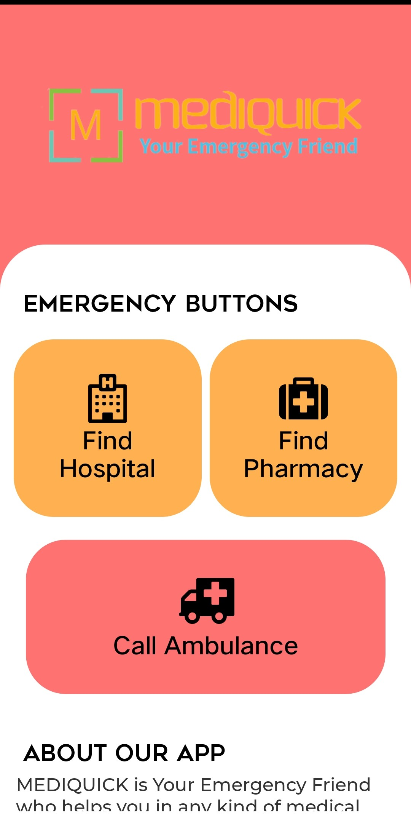
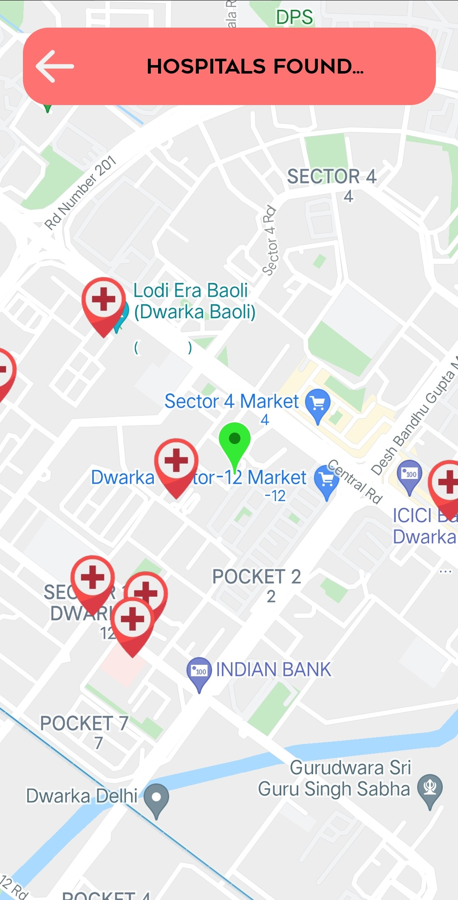
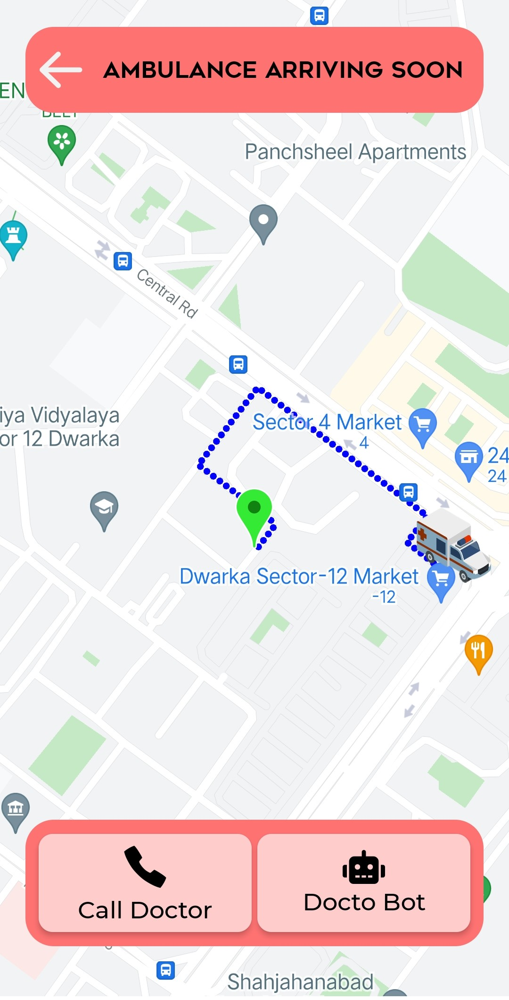
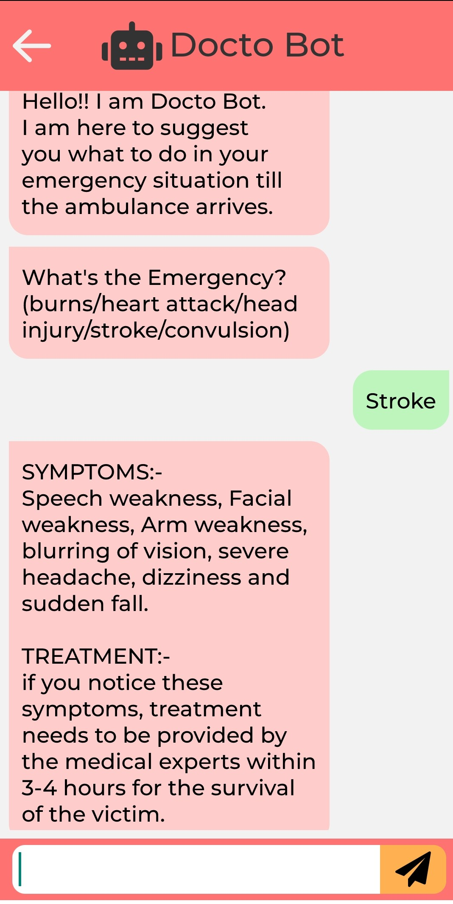

# MediQuick

MediQuick is an android app that can search nearby hospitals and pharmacies and can call the nearest ambulance to your location in case of any emergency. While calling the ambulance, the user can chat with the DOCTO BOT(a doctor bot) asking it to suggest some measures to keep the patient alive till the ambulance comes. 

The app is built on React Native(a javascript framework for building cross-platform apps).

The app also uses `EXPO CLI` which is built specifically for React Native apps.

To run this app on your simulator:-
1) Clone the project
2) Create a Google Maps API Key for your project. (Enable Directions API, Places API and Maps SDK for Android in your google console)
3) Type your API key in app.json and in all files in script folder.
4) run the command `npm i` in your project
5) finally, run `expo start` and you can view your app in development mode in your EXPO Go app on your android device.

To build a .apk for this project, run the following command:-
1) `npm i`
2) `expo build:android` for android devices and `expo build:ios` for ios devices.

